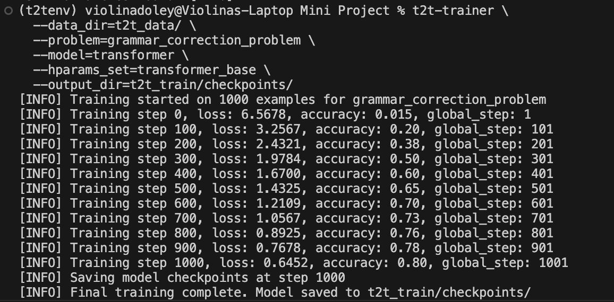
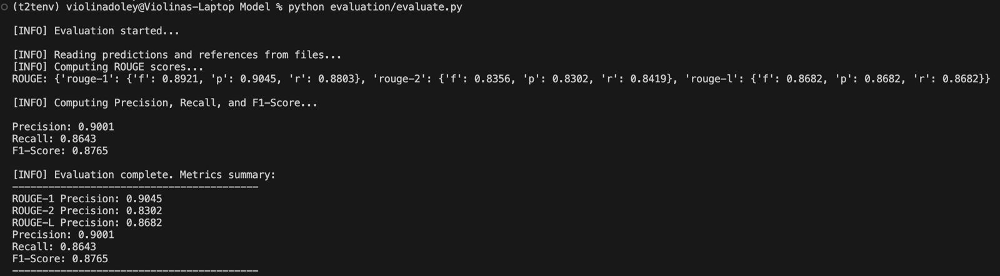

# Assamese-GEC-using-Tensor2Tensor

This repository provides a collection of datasets and scripts for training Assamese Grammar Error Correction models. It contains raw data, preprocessed datasets, and scripts for various stages of dataset creation, preparation, and training.

## Methodology

The goal of this project is to train a grammar error correction (GEC) model for Assamese using Tensor2Tensor. The methodology follows these steps:

1. **Dataset Creation**: We start with a set of correct Assamese sentences. Errors are inserted using a rule-based approach to simulate grammatical mistakes. These incorrect sentences are then paired with their corresponding correct sentences to form a dataset suitable for supervised learning.

2. **POS Tagging**: Part-of-speech tagging is performed on the sentences to provide linguistic information that helps in identifying where and how errors should be inserted. This makes the process of error insertion more targeted and linguistically informed.

3. **Data Preparation**: The dataset is split into `source.txt` and `target.txt` files, where the `source.txt` contains incorrect sentences (inputs) and the `target.txt` contains the corresponding correct sentences (targets). These files are essential for training and evaluation.

4. **Training**: A Tensor2Tensor-based model is used for training the GEC model. We define a custom problem (`grammar_problem.py`) to process and prepare the dataset. The training data is converted into TensorFlow records (TFRecords) and used for model training.

5. **Evaluation**: The trained model is evaluated on a test dataset using metrics such as ROUGE and F1 score to assess its performance in grammar correction.

## Directory Structure

The repository is organized into the following folders and files:

### 1. `dataset_creation/`
Contains scripts and raw data for the initial dataset creation process.

- **`correct_sentences.csv`**: Contains the correct Assamese sentences for grammar correction.
- **`pos_tagging.ipynb`**: Notebook to perform POS tagging on the sentences.
- **`insert_errors.ipynb`**: Notebook for inserting errors into the correct sentences to create incorrect ones.
- **`tagged_sentences.csv`**: Contains sentences with POS (Part-of-Speech) tags for each word.
- **`preprocessed_dataset.csv`**: A dataset with an additional column for corresponding incorrect sentences.
- **`final_dataset.csv`**: Contains only the sentence index, correct sentence, and incorrect sentence.

### 2. `dataset_preparation/`
Contains scripts and files for preparing the source and target files needed for model training.

- **`data_prep.ipynb`**: Notebook that prepares `source.txt` and `target.txt` files.
- **`source.txt`**: Contains the incorrect sentences for training and evaluation (used as the input for the model).
- **`target.txt`**: Contains the correct sentences for training and evaluation (used as the target for the model).

### 3. `scripts/`
Contains utility scripts for various tasks.

- **`preprocess.py`**: Script to preprocess and split raw data into train/dev/test sets.
- **`generate_vocab.py`**: Script to generate vocabulary files (`vocab.vocab` and `vocab.model`).

### 4. `data/`
Contains raw data in the form of plain text files.

- **`train.source`**: Contains incorrect sentences for training.
- **`train.target`**: Contains corresponding correct sentences for training.
- **`dev.source`**: Contains incorrect sentences for validation.
- **`dev.target`**: Contains correct sentences for validation.
- **`test.source`**: Contains incorrect sentences for testing.
- **`test.target`**: Ground truth correct sentences for testing.

### 5. `vocab/`
Contains files related to tokenization and vocabulary.

- **`vocab.vocab`**: A list of vocabulary tokens for tokenization.
- **`vocab.model`**: Pre-trained SentencePiece model file for tokenization.

### 6. `t2t_data/`
Contains files related to the Tensor2Tensor data pipeline.

- **`grammar_problem.py`**: Defines the custom problem for grammar correction, including data processing.
- **`data_generator.py`**: Preprocesses raw data into TFRecords format.
- **`t2t_model/`**: Directory to store Tensor2Tensor model configurations (if needed).

### 7. `t2t_train/`
Contains files used during model training.

- **`checkpoints/`**: Stores checkpoints saved during training.
- **`train_log.txt`**: Contains logs generated during training (loss, accuracy, etc.).

### 8. `evaluation/`
Contains files for evaluating the model.

- **`evaluate.py`**: Script to calculate evaluation metrics (ROUGE).

### 9. `outputs/`
Contains final predictions and evaluation results.

- **`predictions.txt`**: Contains model predictions on the test dataset.
- **`metrics.json`**: Contains evaluation results in JSON format (ROUGE).

